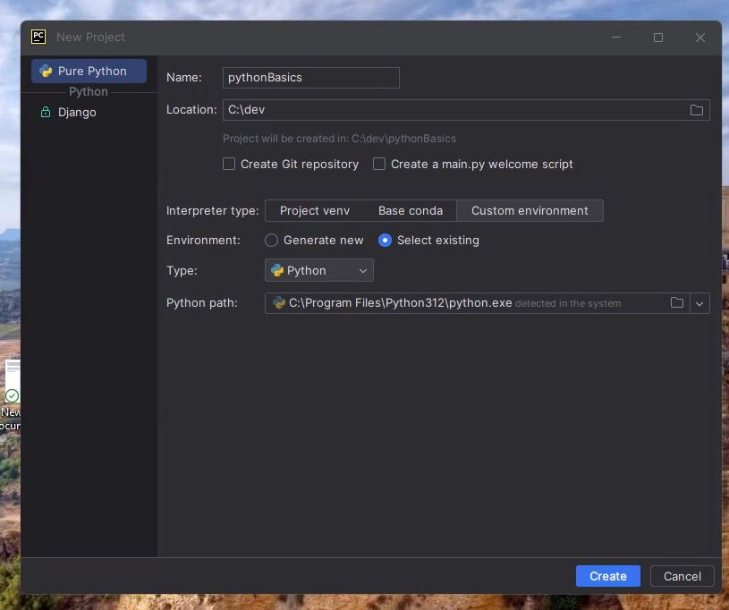

# Pythonbasics project
![LEARNING PYTHON]
This project is about learning basics of Python.We will cover following topics is the project

-Hello world file
-variables: basic data types (integer , float ,string, boolean)
- Data strutures
 -list
 -dictionary


## Markdown language

### title text
#### title text

This is the **bold text** use double asterisks

in markdown we can format links,[click here](https://docs.github.com/en/get-started/writing-on-github/getting-started-with-writing-and-formatting-on-github/basic-writing-and-formatting-syntax) to know more about it.


# showing sample python code
````python
print (" hello world!")

````
Shell scripting sample code:
````shell
cd~
pwd
ls -l
tail -f /var/log/applogfile.log | grep jhond22
````
